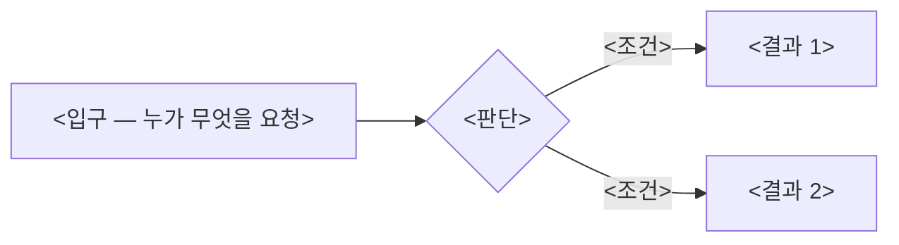

<!-- 이 형식의 원본은 skills/submit-pr-evidence/SKILL.md다 — PR을 열기 전에 그 스킬 절차를 먼저 수행한다. -->

Closes #<번호>
<!-- 티켓이 없으면 이 줄을 `티켓 없음 — <이유 한 줄>`로 바꾼다. -->

## 무엇이 좋아지나

<!-- 한 문단, 줄글로. 이 화면을 쓰는 사람이 어떤 상황에 있었고 이번 변경 뒤 무엇을 할 수 있게 됐는지만 쓴다.
     구현 수단(컴포넌트·라이브러리 이름)은 여기 쓰지 않는다. -->

<한 문단>

## 바로 확인

<!-- 리뷰어가 그대로 눌러볼 수 있는 링크. 확인할 배포 화면이 없으면 이 절 본문을 `확인 링크 없음 — <산출물 위치 또는 이유>`로 바꾼다. -->

https://jnu-oss-hub.com/<path> · <페르소나> · <확인 시각>

직접 누른 경로: <로그인 → … → 뒤로 가기>
확인한 상태: <정상 · 빈 상태 · 결과 없음 · 오류 중 해당하는 것>

## Before / After

<!-- 화면을 건드린 PR만 채운다. 요소 행이 먼저고 필수다 — 바뀐 컴포넌트마다 한 행.
     Before/After는 같은 selector로 찍는다. 티켓에 `현재 화면` selector가 있으면 그대로 재사용한다.
     전체 화면 두 장은 표 안이 아니라 표 아래에 링크로 둔다.
     화면 변경이 없으면 이 절 본문을 `Before/After 없음 — <이유>`로 바꾼다. -->

| 요소 | Before | After |
| --- | --- | --- |
| `<selector>` | " src="https://github.com/JNU-SWCU/oss-hub/releases/download/<tag>/<issue>-before-element-<what>.png"> | " src="…-after-element-<what>.png"> |

<sub>`<selector>` · `<DOM path>` · `/<route>` · 1440x900 · Before `<base sha>` / After `<head sha>` · 합성 데이터</sub>

After 전체 화면: [desktop 1440x900](<url>) · [390x844](<url>)

## 이 흐름이 자연스러운가

<!-- 한 문단, 줄글로. 직접 눌러본 뒤 어색했던 지점과 그 판단 근거. 어색함이 없었다면 무엇을 눌러보고 그렇게 판단했는지를 쓴다.
     화면이 없으면 이 절 본문을 `화면 없음 — <이유>`로 바꾼다. -->

<한 문단>

## 내가 고친 UX 문제

<!-- 화면이 없으면 이 절 본문을 `화면 없음 — <이유>`로 바꾼다.
     표가 비어 있는 것은 "고칠 게 없었다"가 아니라 "직접 눌러보지 않았다"로 읽힌다 — 0건이면 무엇을 검토했고 왜 문제가 없었는지를 문장으로 적는다. -->

| 이상했던 점 | 왜 문제인가 | 어떻게 고쳤나 |
| --- | --- | --- |

## UX 안티패턴 점검

<!-- skills/submit-pr-evidence/references/ux-antipatterns.md의 스무 줄 판정 표 형식 그대로 채운다.
     해당 없으면 이 절 본문을 `UX 안티패턴 해당 없음 — <이유>`로 바꾼다. -->

<스무 줄 판정 표>

이 화면에서 특히 지켜야 하는 항목: <번호와 이유 한 문장>

## 흐름 다이어그램

<!-- backend 로직(분기·상태 전이·인가 경로·재시도 처리·호출 순서·계층 경계)을 바꿨을 때만 채운다.
     첫 다이어그램은 high level(입구 → 판단 → 결과, 노드 8개 이하)로, 상세는 <details> 안에 둔다.
     기준은 skills/submit-pr-evidence/references/backend-diagram.md가 원본이다.
     해당 없으면 이 절 본문을 `흐름 다이어그램 없음 — <이유>`로 바꾼다. -->



<details><summary>상세</summary>

```mermaid
<필드·가드·호출 순서까지>
```

</details>

## 검증

<!-- 다음 사람이 그대로 복사해 실행할 명령과 지금 시점의 기대 결과. 사람이 확인한 행동과 테스트 수치를 함께 적는다.
     지적을 고치고 다시 돌렸으면 이 절을 갱신한다 — 열 때 쓰고 끝나는 절이 아니다. -->

- <사람이 확인한 행동> — <그것이 보장하는 사용자 결과>
- <테스트 수치> — <그 수치가 보장하는 사용자 행동>

## 정리

<!-- 이번에 하지 않은 것 / 리뷰어가 결정해 줘야 하는 것 / 환경 전제는 해당 없으면 "없음"으로 적는다. 체크박스는 넷 다 체크한다. -->

- 이번에 하지 않은 것: <티켓 경계 밖으로 남긴 것과 이유 / 없음>
- 리뷰어가 결정해 줘야 하는 것: <물음 / 없음>
- 환경 전제: <새 env·마이그레이션·수동 절차 / 없음>
- [ ] 로컬 커밋을 전부 push했다
- [ ] `bash scripts/check-public-safe.sh`를 통과했고 본문·캡처에 실명·비밀값·내부 호스트·로컬 경로가 없다
- [ ] `bash scripts/check-pr-body.sh <본문 파일>`을 통과했다
- [ ] submit-pr-evidence 절차를 수행했다
