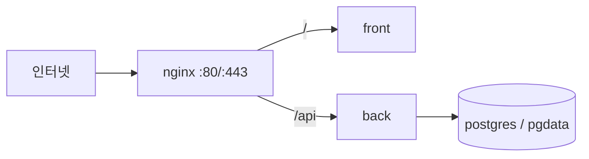

# 시스템 지도

이 문서는 예정된 저장소 구조와 컴포넌트 경계를 보여준다. 기술·운영 결정의 근거는 [ADR 인덱스](decisions/README.md)를 참조하며 이 문서에서 재서술하지 않는다.

## 예정 디렉터리 구조

```text
apps/
├── frontend/                 # Next.js 사용자 인터페이스
└── backend/                  # NestJS REST API
    └── prisma/               # Prisma schema와 migration
deploy/                       # nginx, Jenkins, 서버 배포 설정
compose.yaml                  # 운영 런타임 Compose 정의
compose.dev.yaml              # 개발 PostgreSQL Compose 정의
docs/
├── decisions/                # Architecture Decision Records
├── exec-plan/                # 수동 운영 절차와 실행 기록
└── rules/                    # 구현 규칙
```

## 컴포넌트 경계

- `apps/frontend`는 브라우저 UI와 화면별 상태를 소유하며 API 호출은 단일 클라이언트를 통해 수행한다.
- `apps/backend`는 `/api/v1` REST API, DTO 검증, 업무 규칙, 영속성 접근을 소유한다.
- PostgreSQL은 backend만 직접 접근한다.
- `deploy/`와 Compose 파일은 런타임 네트워크, proxy, 배포 자동화를 소유한다.
- `docs/decisions`는 장기 결정, `docs/exec-plan`은 반복 가능한 수동 운영 절차를 소유한다.

## 배포 런타임



nginx는 `/` 요청을 front로, `/api` 요청을 back으로 전달한다. `/api/v1` 접두사는 proxy에서 제거하지 않는다. 런타임 컨테이너는 nginx, front, back, postgres 네 개다.

## 핵심 흐름

### 요청 경로

1. 브라우저 요청은 nginx의 80 또는 443 포트에 도착한다.
2. UI 경로는 front로 전달되고, `/api` 경로는 back으로 전달된다.
3. back은 `/api/v1` API 계약에 따라 요청을 처리하고 PostgreSQL에 접근한다.
4. 응답은 nginx를 거쳐 브라우저로 반환된다.

### 배포 경로

1. main 병합이 GitHub webhook을 통해 Jenkins 배포를 시작한다.
2. Jenkins는 커밋 SHA를 이미지 태그로 사용해 서버에서 이미지를 한 번 빌드한다.
3. PostgreSQL을 먼저 기동하고 migration을 적용한 뒤 Compose로 서비스를 기동한다.
4. `/`와 `/api/v1/health` smoke check가 성공하면 배포를 유지하고, 실패하면 이전 태그 또는 수동 복구 절차를 따른다.
