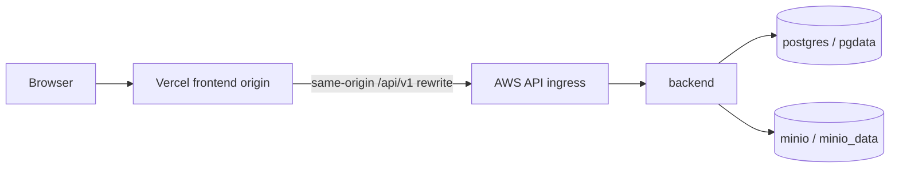
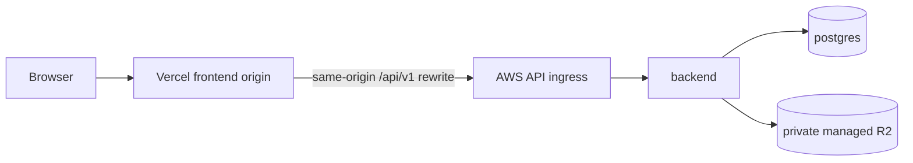

# 시스템 지도

이 문서는 현재 전환 상태와 승인된 목표 경계를 구분한다. 기술·운영 결정의 근거는 [ADR 인덱스](decisions/README.md)를 참조하며, R2 구현 진행 상태는 [Issue #1113](https://github.com/JNU-SWCU/oss-hub/issues/1113)을 참조한다.

## 예정 디렉터리 구조

```text
apps/
├── frontend/                 # Next.js 사용자 인터페이스
└── backend/                  # NestJS REST API
    └── prisma/               # Prisma schema와 migration
deploy/                       # nginx, Jenkins, 서버 배포 설정
compose.yaml                  # 운영 런타임 Compose 정의
compose.dev.yaml              # 개발 PostgreSQL Compose 정의
docs/
├── decisions/                # Architecture Decision Records
├── deploy/                   # 배포 runbook과 수동 운영 절차
└── rules/                    # 구현 규칙
```

## 컴포넌트 경계

- `apps/frontend`는 브라우저 UI와 화면별 상태를 소유하며 API 호출은 단일 클라이언트를 통해 수행한다.
- `apps/backend`는 `/api/v1` REST API, DTO 검증, 업무 규칙, 영속성 접근을 소유한다.
- PostgreSQL은 backend만 직접 접근한다.
- `deploy/`와 Compose 파일은 런타임 네트워크, proxy, 배포 자동화를 소유한다.
- `docs/decisions`는 장기 결정, `docs/deploy`는 배포 runbook과 반복 가능한 수동 운영 절차를 소유한다.

## 현재 전환 상태

프로덕션 제출 파일 저장소는 아직 MinIO이며 R2 cutover는 실행되지 않았다. checkpoint A의 exact-SHA Vercel deployment는 준비됐지만 backend `FRONTEND_URL`·GitHub OAuth callback 전환과 stable-origin smoke가 남아 있어 checkpoint A는 완료되지 않았다. AWS는 backend, PostgreSQL, API ingress를 계속 제공한다. 기존 AWS frontend는 checkpoint B 전까지 보존한다.


```mermaid
flowchart LR
  Browser[Browser] --> Vercel[Vercel frontend origin]
  Vercel -- same-origin /api/v1 rewrite --> Ingress[AWS API ingress]
  Ingress --> Back[backend]
  Back --> Postgres[(postgres / pgdata)]
  Back --> Minio[(minio / minio_data)]
```

## 목표 상태

checkpoint B는 private managed R2 live store에서 storage smoke와 stable-origin smoke가 모두 통과한 뒤에만 완료한다. 그 뒤 Vercel이 유일한 frontend origin이 되고 AWS는 backend, PostgreSQL, API ingress를 유지한다. AWS frontend 제거는 checkpoint B에 포함된 비파괴 작업이며, rollback 보존 기간에는 MinIO 데이터와 rollback 경로를 삭제하지 않는다.

MinIO는 영구 fallback이나 이중화 저장소가 아니다. Managed activation 전 start-free pre-hold receipt가 rollback backup·image를 보호하고, G8 뒤 observation과 canonical pre-hold completion gate가 모두 green일 때 한 번 기록하는 `ROLLBACK_HOLD_START`에서 계산한 72시간이 지나고 final recovery verification과 별도 reviewed cleanup approval가 끝나면 MinIO service, volume, credential, Jenkins 분기를 제거하며 R2만 application object storage로 남긴다.


```mermaid
flowchart LR
  Browser[Browser] --> Vercel[Vercel frontend origin]
  Vercel -- same-origin /api/v1 rewrite --> Ingress[AWS API ingress]
  Ingress --> Back[backend]
  Back --> Postgres[(postgres)]
  Back --> R2[(private managed R2)]
```

backend storage는 `SUBMISSION_FILE_STORAGE_MODE=minio|managed`로 선택한다. 두 모드 모두 `SUBMISSION_FILE_S3_*` 설정을 사용한다. managed 모드의 live-store credential과 rollback MinIO credential은 분리하며, rollback MinIO는 `ROLLBACK_MINIO_*`만 사용한다.

## 핵심 흐름

### 요청 경로

1. 브라우저 UI 요청은 Vercel frontend origin에 도착한다.
2. 브라우저의 `/api/v1` 요청은 Vercel same-origin rewrite를 거쳐 AWS API ingress와 backend로 전달된다. 브라우저가 AWS API origin을 직접 호출하지 않는다.
3. backend는 `/api/v1` API 계약에 따라 요청을 처리하고 PostgreSQL에 접근한다.
4. 제출 파일은 선택된 storage mode의 object store에 저장된다.
5. 응답은 AWS API ingress와 Vercel rewrite를 거쳐 같은 browser origin으로 반환된다.

### 배포 경로

1. PR과 main 병합의 품질 검증은 GitHub Actions `ci`가 단독으로 수행하며 Jenkins는 실행되지 않으므로 병합만으로는 production이 바뀌지 않는다.
2. Jenkins는 draft·prerelease가 아닌 GitHub Release가 발행될 때만 실행되고 그 발행 자체가 배포 인가다.
3. Jenkins는 latest full Release와 tag의 main ancestry를 검증하고 exact commit SHA를 checkout한다.
4. 동일·하위 Release는 no-op으로 종료한다. 새 Release는 database backup → configured-endpoint object backup → build → migration → rollout 순서로 배포한다.
5. configured endpoint와 bucket을 읽어 검증하지 못하는 object backup 또는 restore drill은 fail-closed다. R2의 내구성은 backup이 아니다.
6. checkpoint B 뒤 MinIO rollback은 쓰기 중지 → R2 reverse-copy → object count·size·integrity check → MinIO activation → stable-origin smoke 순서를 따른다. R2 write가 있으면 reverse-copy와 check 없이 MinIO를 재활성화하지 않는다.
