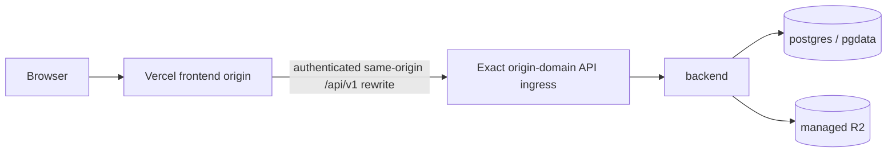
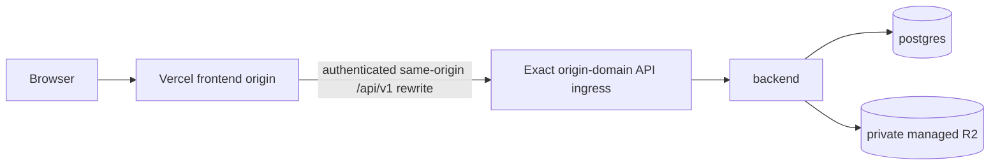

# 시스템 지도

이 문서는 현재 전환 상태와 승인된 목표 경계를 구분한다. 기술·운영 결정의 근거는 [ADR 인덱스](decisions/README.md)를 참조하며, R2 구현 진행 상태는 [Issue #1113](https://github.com/JNU-SWCU/oss-hub/issues/1113)을 참조한다.

## 예정 디렉터리 구조

```text
apps/
├── frontend/                 # Next.js 사용자 인터페이스
└── backend/                  # NestJS REST API
    └── prisma/               # Prisma schema와 migration
deploy/                       # nginx, Jenkins, 서버 배포 설정
compose.yaml                  # 운영 런타임 Compose 정의
compose.dev.yaml              # 개발 PostgreSQL Compose 정의
docs/
├── decisions/                # Architecture Decision Records
├── deploy/                   # 배포 runbook과 수동 운영 절차
└── rules/                    # 구현 규칙
```

## 컴포넌트 경계

- `apps/frontend`는 브라우저 UI와 화면별 상태를 소유하며 API 호출은 단일 클라이언트를 통해 수행한다.
- `apps/backend`는 `/api/v1` REST API, DTO 검증, 업무 규칙, 영속성 접근을 소유한다.
- PostgreSQL은 backend만 직접 접근한다.
- `deploy/`와 Compose 파일은 런타임 네트워크, proxy, 배포 자동화를 소유한다.
- `docs/decisions`는 장기 결정, `docs/deploy`는 배포 runbook과 반복 가능한 수동 운영 절차를 소유한다.

## 현재 전환 상태

Checkpoint A·B와 cleanup이 완료됐다. 구매한 canonical HTTPS custom domain이 유일한 browser origin이며 backend `FRONTEND_URL`·GitHub OAuth callback이 같은 origin을 사용한다. Vercel은 `/api/v1` request에서 browser `Authorization`을 제거하고 production sensitive credential을 주입한 뒤 exact origin domain으로 rewrite한다. Origin nginx는 exact Host·Basic credential·Vercel client header가 모두 맞는 API 요청만 받고, unknown Host·비API path·unintended method를 fail-closed한다. Production storage는 private managed R2이고 AWS는 backend, PostgreSQL, API-only Compose ingress만 제공한다. MinIO와 legacy frontend runtime은 없다.


```mermaid
flowchart LR
  Browser[Browser] --> Vercel[Vercel frontend origin]
  Vercel -- authenticated same-origin /api/v1 rewrite --> Ingress[Exact origin-domain API ingress]
  Ingress --> Back[backend]
  Back --> Postgres[(postgres / pgdata)]
  Back --> R2[(managed R2)]
```

## 보안 경계

- Browser는 canonical custom domain만 사용한다. Origin domain과 infrastructure address는 browser origin·OAuth callback·cookie domain이 아니다.
- Vercel routing layer만 production origin credential을 소유한다. Preview와 browser가 보낸 `Authorization`은 origin 인증에 사용할 수 없다.
- Origin nginx는 Vercel이 덮어쓰는 client header를 rate-limit key로 사용하고 backend로 전달하기 전에 origin credential·provider header를 제거한다.
- Host nginx의 default HTTP/HTTPS server는 unknown Host를 거절하고 exact origin domain의 `/api/`만 연다. Compose nginx도 canonical·loopback Host 외에는 404다.
- Jenkins는 outbound 10분 convergence schedule과 tailnet 수동 실행만 사용한다. Public build trigger와 GitHub deploy token은 없다.
- 위 경계는 proxy-peer 단일 rate bucket, Host spoofing, direct-origin browser access, public Jenkins trigger, legacy IP certificate를 제거한다.


```mermaid
flowchart LR
  Browser[Browser] --> Vercel[Vercel frontend origin]
  Vercel -- authenticated same-origin /api/v1 rewrite --> Ingress[Exact origin-domain API ingress]
  Ingress --> Back[backend]
  Back --> Postgres[(postgres)]
  Back --> R2[(private managed R2)]
```

production backend storage mode는 exact `managed` 하나다. `SUBMISSION_FILE_S3_*` 설정을 사용하고 credential pair는 Jenkins masked binding으로만 주입한다. 로컬 개발의 MinIO substitute는 `compose.local.yml`이 별도로 소유하며 production 계약에 포함되지 않는다.

## 핵심 흐름

### 요청 경로

1. 브라우저 UI 요청은 Vercel frontend origin에 도착한다.
2. 브라우저의 `/api/v1` 요청은 Vercel same-origin rewrite를 거쳐 AWS API ingress와 backend로 전달된다. 브라우저가 AWS API origin을 직접 호출하지 않는다.
3. backend는 `/api/v1` API 계약에 따라 요청을 처리하고 PostgreSQL에 접근한다.
4. 제출 파일은 private managed R2에 저장된다.
5. 응답은 AWS API ingress와 Vercel rewrite를 거쳐 같은 browser origin으로 반환된다.

### 배포 경로

1. PR과 main 병합의 품질 검증은 GitHub Actions `ci`가 단독으로 수행하며 Jenkins는 실행되지 않으므로 병합만으로는 production이 바뀌지 않는다.
2. Jenkins는 draft·prerelease가 아닌 GitHub Release가 발행될 때만 실행되고 그 발행 자체가 배포 인가다.
3. Jenkins는 latest full Release와 tag의 main ancestry를 검증하고 exact commit SHA를 checkout한다.
4. 동일·하위 Release는 no-op으로 종료한다. 새 Release는 database backup → configured-endpoint object backup → build → migration → rollout 순서로 배포한다.
5. Configured endpoint와 bucket을 읽어 검증하지 못하는 SDK object backup은 fail-closed다. R2의 내구성은 backup을 대체하지 않는다.
6. 애플리케이션 rollback은 captured previous backend image ID·version·revision이 exact match할 때만 수행한다. Production storage mode를 되돌리는 경로는 없다.
