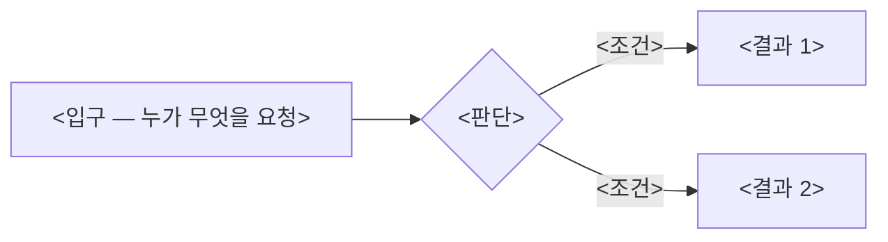
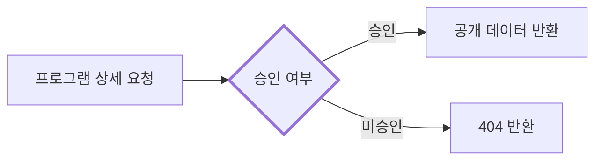
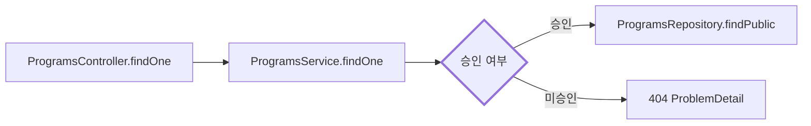

# backend 흐름 다이어그램을 PR에 올린다

backend 로직이 바뀌면 그 변경을 텍스트 설명 대신 그림으로 남긴다 — 분기와 호출 순서는 diff만 읽어서는 리뷰어가 재구성하기 어렵다.

## 다이어그램이 필요한 변경

- 분기 추가·삭제
- 상태 전이 변경
- 인가(authorization) 경로 변경
- 비동기 작업의 retry·실패 처리 변경
- 호출 순서 변경
- Controller → Service → Repository 경계 이동

## 필요하지 않은 변경

- rename
- 타입만 바뀜
- 포매팅
- 테스트만 변경
- 로그 문구 변경

## 형식 — high level이 먼저다

리뷰어가 첫 그림만 보고 「이 PR이 흐름을 어디서 바꿨나」를 10초 안에 답할 수 있어야 한다.
그래서 다이어그램은 항상 두 단으로 낸다.

1. **첫 다이어그램(항상 보임)** — 입구 → 판단 → 결과. 노드는 8개 이하, 바뀐 흐름 하나에 하나만 그린다.
   노드 이름은 클래스·메서드 이름이 아니라 「무엇이 일어나는가」를 말로 쓴다(예: `ProgramsController.findOne`이 아니라 `프로그램 상세 요청`).
2. **상세 다이어그램(`<details>` 안)** — 필드·가드·호출 순서까지 실제 class·method 이름으로 그린다. 펼쳐야 보이므로 필요한 사람만 연다.

````markdown


<details><summary>상세</summary>

```mermaid
<필드·가드·호출 순서까지, 실제 class·method 이름>
```

</details>
````

기본은 mermaid 코드블록이다 — GitHub이 native로 렌더한다.

- 호출 흐름은 ` ```mermaid ` + `flowchart`.
- 상태 전이는 ` ```mermaid ` + `stateDiagram-v2`.
- 아키텍처 변경(모듈·경계 이동)은 같은 두 단 제한으로 컴포넌트 다이어그램(상자 = 모듈, 화살표 = 호출)을 그린다.

mermaid로 표현할 수 없는 구조에 한해 ` ```dot ` (Graphviz)를 대체로 쓴다.
GitHub은 DOT를 렌더하지 않으므로, DOT를 쓸 때는 소스 코드블록과 함께 렌더된 PNG를 GitHub 웹 에디터로 PR 본문에 첨부한다 — 소스만 붙이면 리뷰어가 그림을 보지 못한다.

## 내용 규칙

- 흐름이 바뀌었으면 첫 다이어그램에서 Before와 After를 나란히 두 개 그리거나, 하나의 다이어그램에서 바뀐 간선을 `-.->`·`style ... stroke-width`로 강조한다.
- 노드 이름은 첫 다이어그램은 말로, 상세 다이어그램은 실제 class·method 이름으로 쓴다. 가상의 이름을 지어내지 않는다.
- 실데이터·시크릿·개인정보 값을 노드에 넣지 않는다 — [보안 규칙](../../../docs/rules/security.md)의 deny-list가 여기도 적용된다.
- 다이어그램 아래에 1~3줄로 "무엇이 왜 바뀌었나"를 쓴다.

## 예시

`ProgramsController`가 승인 여부를 직접 검사하던 것을 `ProgramsService`로 옮기고, 미승인 요청은 조회 전에 걸러지도록 바꾼 경우.



<details><summary>상세</summary>



</details>

승인 분기가 Controller에서 Service로 이동해 동일 검사가 다른 진입점에서도 재사용된다.
미승인 요청은 Repository 접근 전에 걸러져 private row가 조회되지 않는다.

## 어디에 넣는가

PR 본문의 `## 흐름 다이어그램` 섹션에 넣는다.
그 heading은 PR 템플릿이 이미 제공한다.
